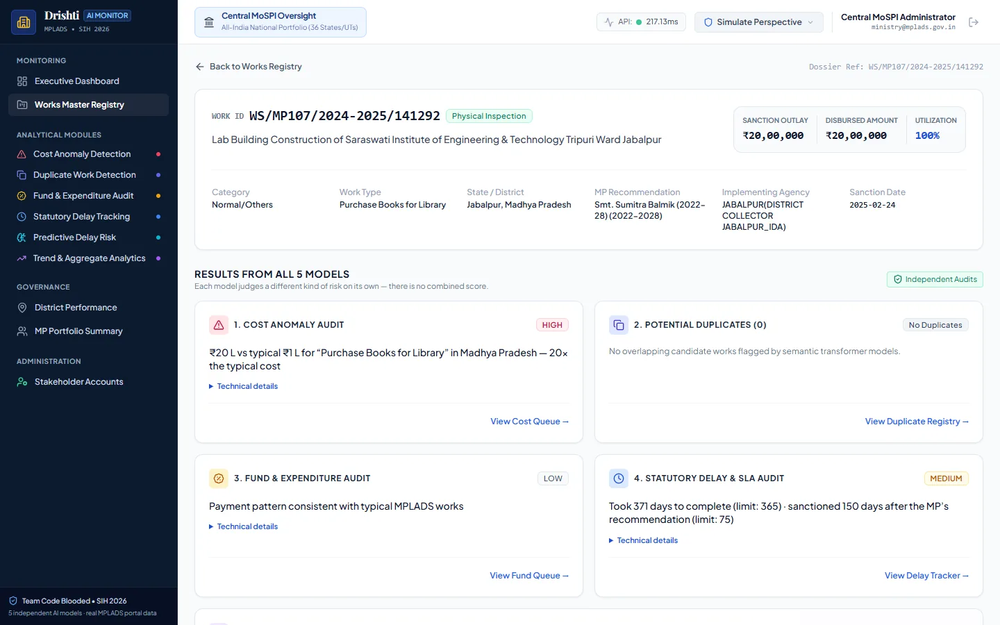
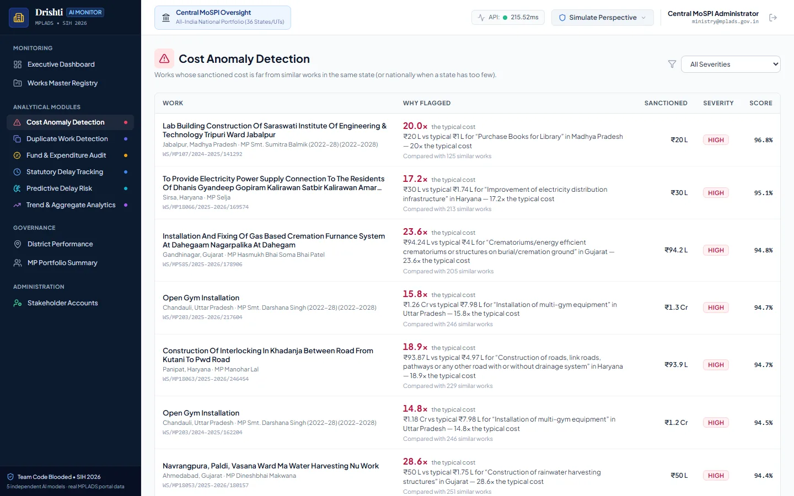
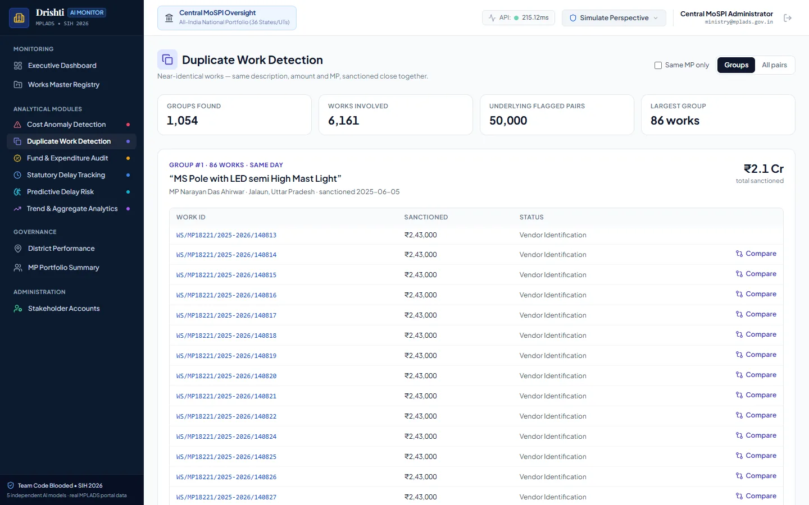
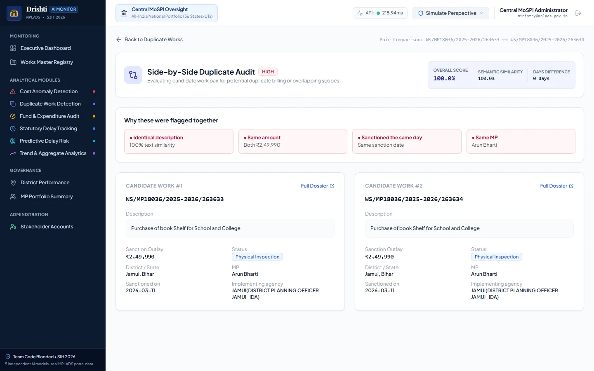
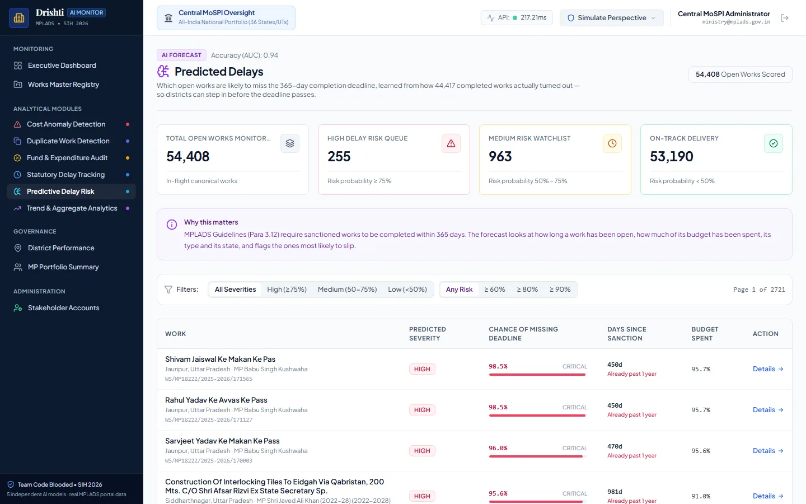
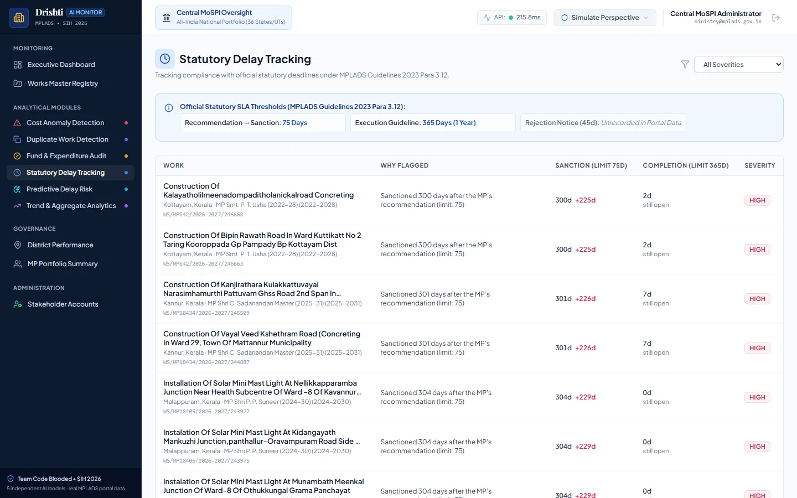
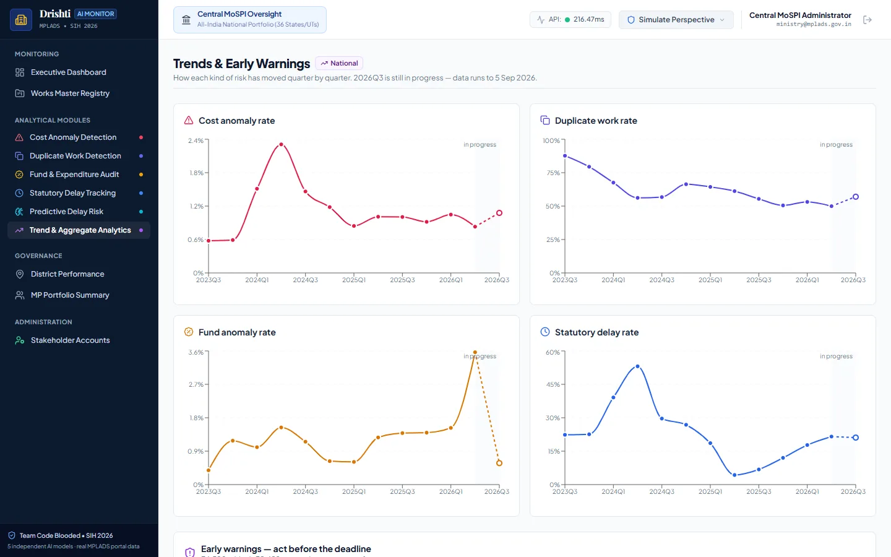
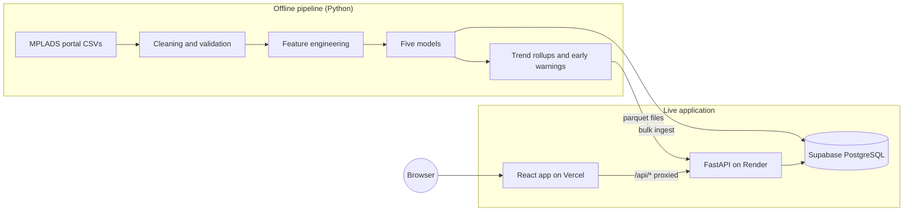

# Drishti: AI Risk Monitoring for MPLADS Works

Drishti analyses public data on India's **Members of Parliament Local Area Development Scheme (MPLADS)** and flags works that need a closer look: inflated cost estimates, likely duplicate projects, unusual payment patterns, missed statutory deadlines, and open works likely to run late. Each finding comes with a plain-language reason, and every user sees only their own jurisdiction.

**Live demo:** [risk-analyzer-kohl.vercel.app](https://risk-analyzer-kohl.vercel.app/) · **API docs:** [Swagger UI](https://drishti-api-vofd.onrender.com/api/v1/docs)


## Contents

1. [The Problem](#the-problem)
2. [What Drishti Does](#what-drishti-does)
3. [Try the Live Demo](#try-the-live-demo)
4. [Screenshots](#screenshots)
5. [The Data](#the-data)
6. [The Five Models](#the-five-models)
7. [Architecture](#architecture)
8. [Tech Stack](#tech-stack)
9. [Access Control and Security](#access-control-and-security)
10. [API Reference](#api-reference)
11. [Running Locally](#running-locally)
12. [Deployment](#deployment)
13. [Testing](#testing)
14. [Repository Structure](#repository-structure)
15. [Design Decisions](#design-decisions)
16. [Limitations](#limitations)
17. [About This Project](#about-this-project)

---

## The Problem

Under MPLADS, every Member of Parliament can recommend local development works (roads, school buildings, drinking water, health facilities) worth up to ₹5 crore a year. District authorities then sanction, fund and execute those works.

The scale makes manual oversight impractical. This dataset alone covers **98,825 works** worth **₹5,891 crore** across **36 States/UTs**, recommended by **714 MPs**. Problems that are easy to spot in a single file are hard to find across that many records:

- **Inflated estimates:** a work sanctioned at many times the cost of similar works in the same state.
- **Duplicate works:** near-identical projects sanctioned more than once.
- **Payment irregularities:** works marked complete with no payments recorded, or money released in unusually small fragments.
- **Statutory delays:** the guidelines require sanction within 75 days of an MP's recommendation, and over half of all works miss that deadline.

## What Drishti Does

- **Five independent risk models.** Each one checks a different kind of risk and produces its own score, severity and explanation. Drishti deliberately does not merge them into a single "fraud score" (see [Design Decisions](#design-decisions)).
- **Plain-language reasons.** Every flag says why it was raised, for example *"₹20 L vs typical ₹1 L for Purchase Books for Library in Madhya Pradesh: 20× the typical cost"*.
- **Role-based views.** Ministry, State, District and MP users each see only their own jurisdiction. This is enforced on the server, not just hidden in the UI.
- **Work dossier.** One page per work showing all five model results side by side.
- **Duplicate groups.** Flagged duplicate pairs are combined into groups of near-identical works, so reviewers can handle a cluster of similar works as one case instead of hundreds of separate pairs.
- **Trends and early warnings.** Quarterly trends by state, district and MP, plus a ranked queue of works that are about to breach a statutory deadline.

## Try the Live Demo

Open **[risk-analyzer-kohl.vercel.app](https://risk-analyzer-kohl.vercel.app/)**, click **Try Live Demo**, and choose a role. No sign-up is needed.

| Role | What it sees | Demo login |
|---|---|---|
| Central Ministry | All of India | `ministry@mplads.gov.in` |
| State Nodal Officer | Uttar Pradesh only | `state.up@mplads.gov.in` |
| District Officer | Patna, Bihar only | `district.patna@mplads.gov.in` |
| Member of Parliament | One MP's works | `mp.khalsa@mplads.gov.in` |

All demo accounts use the password `Mplads@Demo2026#`. After logging in, use **Simulate Perspective** in the header to switch roles and compare what each one can see.

> The backend runs on a free hosting plan. If it has been idle, the first request can take up to a minute while it wakes up.

## Screenshots

Click any screenshot to open it at full size.

<table>
  <tr>
    <td width="50%" valign="top">
      
      <p><b>Landing page</b><br>What Drishti does, with one-click access to the demo.</p>
    </td>
    <td width="50%" valign="top">
      
      <p><b>Work dossier</b><br>All five model results for a single work, each with its own reason.</p>
    </td>
  </tr>
  <tr>
    <td width="50%" valign="top">
      
      <p><b>Cost anomalies</b><br>Each flagged work, how many times the typical cost it was sanctioned at, and its peer group size.</p>
    </td>
    <td width="50%" valign="top">
      
      <p><b>Duplicate groups</b><br>50,000 flagged pairs grouped into 1,054 groups of near-identical works.</p>
    </td>
  </tr>
  <tr>
    <td width="50%" valign="top">
      
      <p><b>Duplicate comparison</b><br>Two works side by side, with the evidence that links them.</p>
    </td>
    <td width="50%" valign="top">
      
      <p><b>Predicted delays</b><br>Open works most likely to miss the 365-day completion deadline.</p>
    </td>
  </tr>
  <tr>
    <td width="50%" valign="top">
      
      <p><b>Statutory delays</b><br>Works that broke the 75-day sanction or 365-day completion limits.</p>
    </td>
    <td width="50%" valign="top">
      
      <p><b>Trends and early warnings</b><br>Quarterly risk rates, with the current partial quarter marked.</p>
    </td>
  </tr>
</table>

## The Data

All data comes from the public **MPLADS portal**: works recommended, sanctioned and completed, plus payment vouchers, for the **18th Lok Sabha** and **sitting Rajya Sabha** members.

| Measure | Value |
|---|---|
| Works | 98,825 (Lok Sabha 79,219 · Rajya Sabha 19,606) |
| Payment vouchers | 109,311 |
| Sanctioned value | ₹5,891 crore |
| Disbursed value | ₹4,022 crore (68.3% utilisation) |
| Coverage | 36 States/UTs · 767 districts · 714 MPs |
| Reference date | 5 September 2026 (latest sanction date in the data; used for all "days elapsed" calculations so results are reproducible) |

The cleaning pipeline normalises Indian currency formats and mixed date formats, strips hidden control characters from descriptions, removes "grand total" rows from portal exports, and checks that every voucher and model result links to a valid work (zero orphaned records). Full details are in [`data/reports/data_quality_report.md`](data/reports/data_quality_report.md).

## The Five Models

Every model scores each work between 0 and 1, assigns a severity (`LOW`, `MEDIUM` or `HIGH`), and writes a short explanation. The counts below are what the live demo serves.

| # | Model | Question it answers | Method | High-severity findings |
|---|---|---|---|---|
| 1 | Cost anomaly | Is this work's sanctioned cost unusually high compared with similar works? | Isolation Forest against peer groups (same work type, same state) | **986** works |
| 2 | Duplicate works | Has a near-identical work already been sanctioned? | Sentence embeddings (MiniLM) plus amount, date, MP and constituency similarity | **50,000** pairs, forming **1,054** groups (6,161 works) |
| 3 | Fund & payments | Is the payment pattern unusual? | Isolation Forest on payment features, plus rules for works with no payments | **1,333** works |
| 4 | Statutory delays | Did the work miss a legal deadline? | Rule engine for the 75-day sanction and 365-day completion limits | **15,263** works |
| 5 | Delay prediction | Is this open work likely to miss its 365-day deadline? | Gradient boosting classifier trained on completed works | **255** works |

### 1. Cost anomaly detection

Compares each work's sanctioned amount with similar works at the time of sanction, using only information available at that point (no later payment data, so there is no leakage). Works are compared with the same work type in the same state; if fewer than 15 such peers exist, the comparison falls back to the same work type nationally (4.5% of works), then to all works (0.1%).

- **Features:** log sanctioned amount, ratio to the peer median, deviation from the peer interquartile range.
- **Results:** 986 high · 4,279 medium · 93,547 low. Three works sanctioned for under ₹1,000 are flagged as data-quality issues instead of being scored.
- **Example:** `WS/MP107/2024-2025/141292`, "Purchase Books for Library" in Madhya Pradesh, was sanctioned at ₹20 lakh against a peer median of ₹1 lakh: 20 times the typical cost.

Details: [`data/reports/model1_cost_anomaly_report.md`](data/reports/model1_cost_anomaly_report.md)

### 2. Duplicate work detection

Comparing every work with every other would mean about 4.9 billion pairs. The model first narrows this to **2,025,667 candidate pairs** (same state, same category, sanctioned within 90 days of each other), then scores each pair:

```
duplicate_score = 0.65 × description similarity + 0.35 × structural similarity
structural      = 0.35 × amount similarity + 0.35 × date proximity
                + 0.15 × same MP + 0.15 × same constituency
```

Descriptions are embedded with `all-MiniLM-L6-v2`. Very short or very common descriptions (such as "Installation of Street Light", which appears 50+ times nationally) have their confidence reduced. The top 50,000 pairs (score ≥ 0.70) are stored and grouped into **1,054 groups covering 6,161 works**; the largest group has 86 near-identical works.

Details: [`data/reports/model2_duplicate_work_report.md`](data/reports/model2_duplicate_work_report.md)

### 3. Fund and payment anomaly detection

Works are split into two groups:

- **Works with payments (71,928):** scored by an Isolation Forest on utilisation, how concentrated the payments are (Herfindahl index), number of payments, total paid, time to first payment, and spending window.
- **Works without payments (26,897):** classified by rules:
  - normal and awaiting payment: 21,765
  - **dormant**, sanctioned over a year ago with nothing paid: 4,198
  - **status mismatch**, marked complete or inspected but with no payments recorded: 934

**Results:** 1,333 high · 5,023 medium · 92,469 low.

Details: [`data/reports/model3_fund_expenditure_report.md`](data/reports/model3_fund_expenditure_report.md)

### 4. Statutory delay rule engine

Deadlines in MPLADS are legal requirements, so this is a transparent rule engine rather than a statistical model. It checks three things:

| Check | Limit | Result |
|---|---|---|
| Recommendation → sanction (Guidelines para 3.12) | 75 days | 50,432 of 98,825 works (51%) exceeded it |
| Sanction → completion (completed works) | 365 days | 5,370 of 44,417 works (12%) exceeded it |
| Open work ageing | 365 days | 13,768 of 54,408 open works (25%) are past it |

**Results:** 15,263 high · 23,526 medium · 21,803 low · 38,233 on schedule.

Details: [`data/reports/delay_rule_engine_report.md`](data/reports/delay_rule_engine_report.md)

### 5. Delay prediction

Predicts whether each of the **54,408 open works** will exceed the 365-day completion limit.

- **Training data:** the 44,417 completed works, labelled by whether they took longer than 365 days.
- **Model:** scikit-learn `GradientBoostingClassifier` (100 trees, depth 5).
- **Features:** days since sanction, share of budget spent, number of payments, whether any payment has been made, and frequency-encoded work category and state.
- **Validation:** AUC-ROC of **0.937** on a 20% stratified hold-out set (8,884 works).
- **Results:** 255 high · 963 medium · 53,190 low.

## Architecture



- **Offline:** the models run once over the full dataset, and their results are written to PostgreSQL. Trend rollups and early warnings are stored as parquet files.
- **Online:**
  - The API serves those precomputed results. It applies jurisdiction filters, adds the work context and plain-language reasons, and caches static aggregations in memory.
  - Because nothing is computed at request time, the deployed API doesn't need PyTorch or scikit-learn ([`requirements-api.txt`](requirements-api.txt)) and runs comfortably on a 512 MB free instance.
- **Frontend:** a single-page React app. Vercel forwards `/api/*` requests to the Render backend, so the browser only ever talks to one domain.

## Tech Stack

| Layer | Technologies |
|---|---|
| Data and models | Python 3.13, pandas, NumPy, scikit-learn (Isolation Forest, Gradient Boosting), sentence-transformers (`all-MiniLM-L6-v2`), PyTorch |
| Backend | FastAPI, Pydantic v2, SQLAlchemy 2, psycopg2, PyJWT, bcrypt, SlowAPI |
| Database | PostgreSQL 17 on Supabase |
| Frontend | React 19, TypeScript, Vite, Tailwind CSS, TanStack Query, Recharts, React Router |
| Hosting | Vercel (frontend), Render (API), Supabase (database), cron-job.org (keep-alive ping) |
| Testing | pytest (125 tests) |

## Access Control and Security

**Roles and scope.** Each user has one role, and the server adds that role's jurisdiction filter to every database query:

| Role | Can see |
|---|---|
| `MINISTRY` | All works nationally; can manage accounts |
| `STATE_OFFICER` | Works in their state |
| `DISTRICT_OFFICER` | Works in their district (matched on state and district, because district names repeat across states) |
| `MP` | Works they recommended |

If a user asks for a work outside their scope, the API returns `403`. If the work doesn't exist, it returns `404`.

**Security measures**

- **Passwords:** hashed with bcrypt (12 rounds). Failed logins for unknown emails still run a dummy hash, so response time doesn't reveal which emails exist.
- **Sessions:** short-lived JWTs (60 minutes). Each request also re-checks the user in the database, so a deactivated account loses access immediately.
- **Login rate limit:** 20 attempts per minute per visitor, identified by their real IP address behind the hosting proxy.
- **Database access:** row-level security is enabled on every table, so Supabase's public REST API can't read or modify data. Only the backend's database role can.
- **Demo mode:** the public deployment sets `DEMO_MODE=true`, which disables account creation because the demo credentials are public.
- **Secrets:** stored only in environment variables, never in the repository. The API refuses to start without a JWT secret.

## API Reference

Interactive documentation: [`/api/v1/docs`](https://drishti-api-vofd.onrender.com/api/v1/docs). All endpoints except health, filters and login require a `Bearer` token. List endpoints are paginated with `page` and `page_size` (max 100) and return results filtered to the caller's jurisdiction.

| Area | Endpoints |
|---|---|
| System | `GET /api/v1/health` · `GET /api/v1/meta/filters` |
| Auth | `POST /api/v1/auth/login` · `GET /api/v1/auth/me` · `GET /api/v1/auth/users` (Ministry) · `POST /api/v1/auth/users` (Ministry, disabled in demo mode) |
| Works | `GET /api/v1/works` · `GET /api/v1/works/{work_id}` (dossier with all five model results) |
| Cost anomalies | `GET /api/v1/analytics/cost-anomalies` · `GET /api/v1/analytics/cost-anomalies/{work_id}` |
| Duplicates | `GET /api/v1/analytics/duplicate-works` · `.../duplicate-works/groups` · `.../duplicate-works/summary` · `.../duplicate-works/pairs/{work_id}` |
| Fund anomalies | `GET /api/v1/analytics/fund-anomalies` · `GET /api/v1/analytics/fund-anomalies/{work_id}` |
| Delays | `GET /api/v1/analytics/delays` · `GET /api/v1/analytics/delays/{work_id}` |
| Predictions | `GET /api/v1/analytics/predictions/delay-risk` · `GET /api/v1/analytics/predictions/delay-risk/{work_id}` |
| Summaries | `GET /api/v1/analytics/district-summary` · `GET /api/v1/analytics/mp-summary` |
| Trends | `GET /api/v1/analytics/trends/{national,state,district,mp}` · `GET /api/v1/analytics/trends/early-warnings` |

Work IDs contain slashes (for example `WS/MP107/2024-2025/141292`) and are passed as-is in the path.

A ready-made Postman collection is included: [`MPLADS_Postman_Collection.json`](MPLADS_Postman_Collection.json).

## Running Locally

**Prerequisites:** Python 3.12+, Node.js 20.19+ (or 22.12+), and a PostgreSQL database (a free Supabase project works).

### 1. Configure the environment

```bash
cp .env.example .env
```

Set at least:

- `DATABASE_URL`: your PostgreSQL connection string. For Supabase, use the **pooler** connection string.
- `JWT_SECRET_KEY`: a long random string, for example from `python -c "import secrets; print(secrets.token_hex(32))"`.

### 2. Start the API

```bash
pip install -r requirements-api.txt      # API only; use requirements.txt for the full pipeline
uvicorn api.main:app --reload --port 8000
```

The API runs at `http://127.0.0.1:8000`, with docs at `http://127.0.0.1:8000/api/v1/docs`.

### 3. Start the frontend

```bash
cd frontend
npm install
npm run dev
```

Open `http://localhost:5173`. The dev server forwards `/api` requests to port 8000.

### 4. Load the data (first-time setup on an empty database)

Create the tables by running [`database/schema.sql`](database/schema.sql) in your database (for example in the Supabase SQL editor). Then rebuild the outputs and load them:

```bash
pip install -r requirements.txt          # includes PyTorch and scikit-learn

python -m data_pipeline.pipeline                       # clean raw portal data
python -m feature_engineering.pipeline                 # build features
python -m ml_models.cost_anomaly.pipeline              # model 1
python -m ml_models.duplicate_work.pipeline            # model 2 (slowest: embeds ~75k descriptions)
python -m ml_models.fund_expenditure_anomaly.pipeline  # model 3
python -m rule_engines.delay.pipeline                  # model 4
python -m ml_models.delay_predictor.train              # model 5: train
python -m ml_models.delay_predictor.predict            # model 5: score open works
python -m analytics.trends.pipeline                    # trends and early warnings
python -m database.ingest                              # load everything into PostgreSQL
python -m database.seed_users                          # create the four demo accounts
```

## Deployment

The live demo runs entirely on free plans:

1. **Backend (Render):** [`render.yaml`](render.yaml) is a Render Blueprint.
   - It defines the web service: Singapore region, slim install list, `DEMO_MODE=true`, and a health check on `/api/v1/health`.
   - Render generates the JWT secret automatically; `DATABASE_URL` is entered in the Render dashboard.
2. **Frontend (Vercel):** import the repository with `frontend` as the root directory. [`frontend/vercel.json`](frontend/vercel.json) forwards `/api/*` to the Render service and sends all other routes to the single-page app.
3. **Keep-alive:** Render's free instances sleep after 15 minutes without traffic. A [cron-job.org](https://cron-job.org) job requests `/api/v1/health` every 10 minutes, which keeps the API awake and the Supabase project active.

## Testing

```bash
python -m pytest tests/ -v
```

The suite has **125 tests**. Most of them run against the live database, so they need a populated `DATABASE_URL`.

| Area | Files | Tests |
|---|---|---|
| Data cleaning and features | `test_pipeline.py`, `test_feature_engineering.py` | 20 |
| Database integrity | `test_database_ingestion.py` | 6 |
| Models 1–5 | `test_model1_cost_anomaly.py`, `test_model2_duplicate_work.py`, `test_model3_fund_expenditure.py`, `test_delay_rules.py`, `test_model5_delay_predictor.py` | 37 |
| Trends and early warnings | `test_trend_rollups.py`, `test_early_warnings.py`, `test_trend_api.py` | 13 |
| API, authentication and access control | `test_api.py`, `test_auth_rbac.py` | 34 |
| Dashboard data (reasons, duplicate groups, summaries, demo mode, rate limit) | `test_dashboard_enrichment.py` | 15 |

> Some model tests re-run parts of the pipeline and rewrite files under `data/` and `models/`. Run `git status` afterwards and restore those files if you don't intend to commit regenerated outputs.

## Repository Structure

```
├── api/                      FastAPI application
│   ├── auth/                 JWT, password hashing, rate limiting, jurisdiction scoping
│   ├── routers/              Endpoints (works, models, summaries, trends, auth, health)
│   ├── schemas/              Pydantic request/response models
│   ├── enrichment.py         Work context and plain-language reasons for each finding
│   ├── duplicate_groups.py   Groups duplicate pairs into clusters
│   ├── cache.py, warmup.py   In-memory cache, warmed at startup
│   └── main.py               App entry point
├── analytics/trends/         Quarterly trend rollups and early-warning engine
├── data/
│   ├── original/             Raw MPLADS portal exports
│   ├── features/             Engineered features (parquet)
│   ├── model_outputs/        Model scores, trends and warnings (parquet)
│   └── reports/              Data-quality and model reports
├── data_pipeline/            Cleaning and validation of raw data
├── database/                 Schema, ORM models, bulk ingestion, demo-user seeding
├── docs/                     Requirements specification, design notes, README screenshots
├── feature_engineering/      Feature construction for all models
├── frontend/                 React + TypeScript single-page app
├── ml_models/                Models 1, 2, 3 and 5 (training and scoring)
├── models/                   Trained model artifacts
├── rule_engines/delay/       Model 4: statutory deadline rules
├── tests/                    pytest suite
├── render.yaml               Render Blueprint (backend deployment)
├── requirements.txt          Full environment (pipeline and models)
└── requirements-api.txt      Slim environment for the deployed API
```

## Design Decisions

- **Five separate scores instead of one combined risk score.** A work can be on time and correctly paid but still have an inflated estimate; another can duplicate a nearby work at a perfectly normal price. Averaging these hides exactly what an auditor needs to know, so each model reports on its own.
- **A rule engine for deadlines, machine learning for forecasts.** Missed deadlines are a matter of law (75 days, 365 days), so they're checked with explicit rules that anyone can verify. Predicting which open works *will* be late is a pattern-recognition problem, so that part uses a supervised model.
- **Security enforced on the server.** Jurisdiction filters are added to the SQL query itself. Hiding data in the UI is never treated as access control.
- **Precomputed results.** Scoring runs offline, and the API only reads results. This keeps responses fast, makes the hosted API small enough for a free tier, and means every user sees the same reproducible numbers.
- **Candidate blocking for duplicates.** Restricting comparisons to the same state and category, within 90 days, cuts 4.9 billion possible pairs to about 2 million, which makes transformer-based comparison practical.

## Limitations

- **A flag is not proof.** High scores mark works for review; they don't establish wrongdoing. Legitimate phased works (for example "Road Phase 1" and "Road Phase 2") can look like duplicates.
- **No physical-progress data.** The portal records status labels (such as "Work in Progress"), not percentage completion.
- **Rejection deadlines can't be checked.** The guidelines require MPs to be told about a rejection within 45 days, but the portal doesn't record rejected works.
- **Payments can't exceed the sanctioned amount.** Cost overruns after sanction therefore don't show up in the data. Model 1 can only judge the sanctioned estimate itself.
- **Recorded transactions only.** Payments made outside the portal aren't visible.

## About This Project

Built for **Smart India Hackathon 2026, Problem Statement 26102** (AI-powered monitoring of MPLADS works). The full requirements specification is in [`docs/SRS_MPLADS_AI_Monitoring_System.md`](docs/SRS_MPLADS_AI_Monitoring_System.md).

Drishti is an independent project built on publicly available MPLADS portal data. It is not affiliated with or endorsed by the Ministry of Statistics and Programme Implementation (MoSPI) or the Government of India. The ministry-style labels and demo accounts are illustrative.
